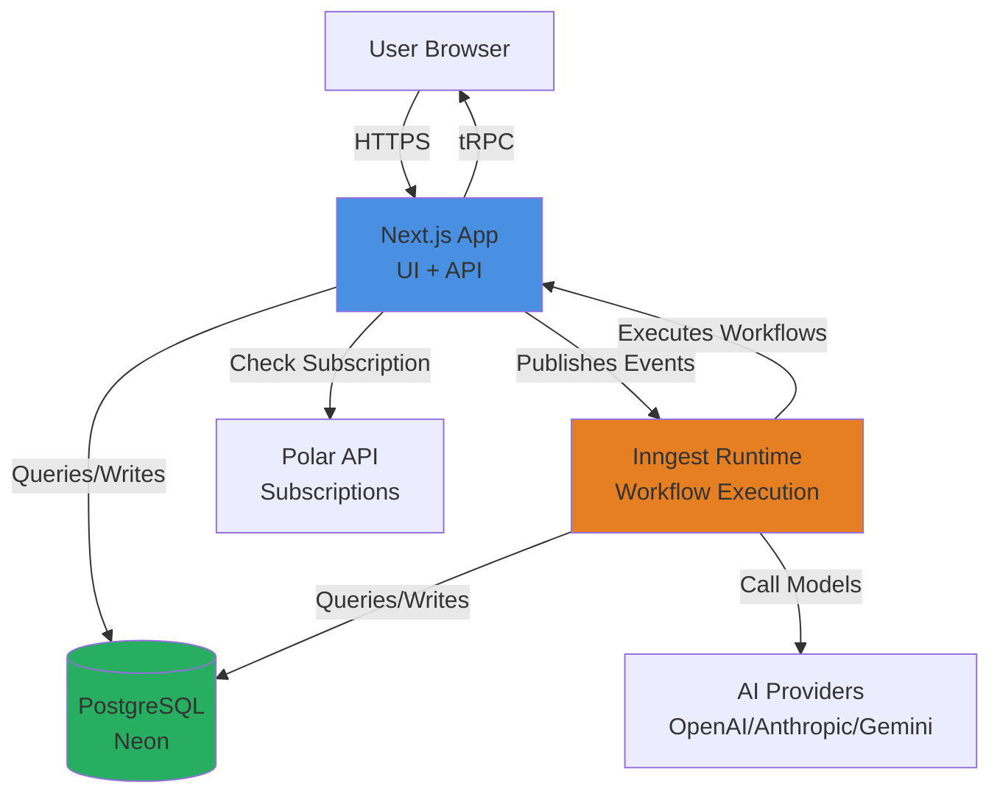
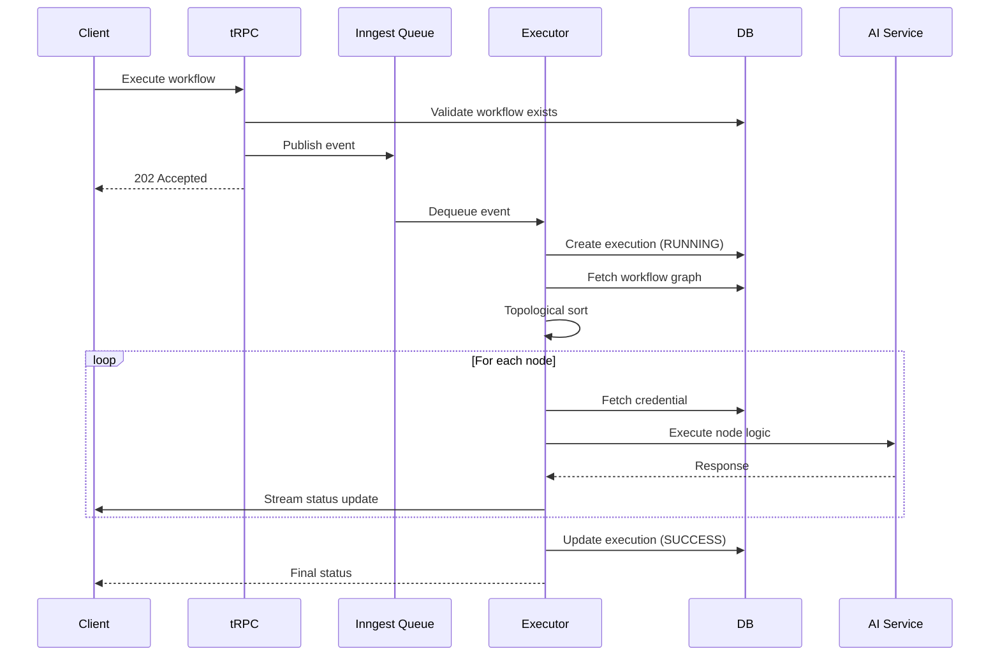
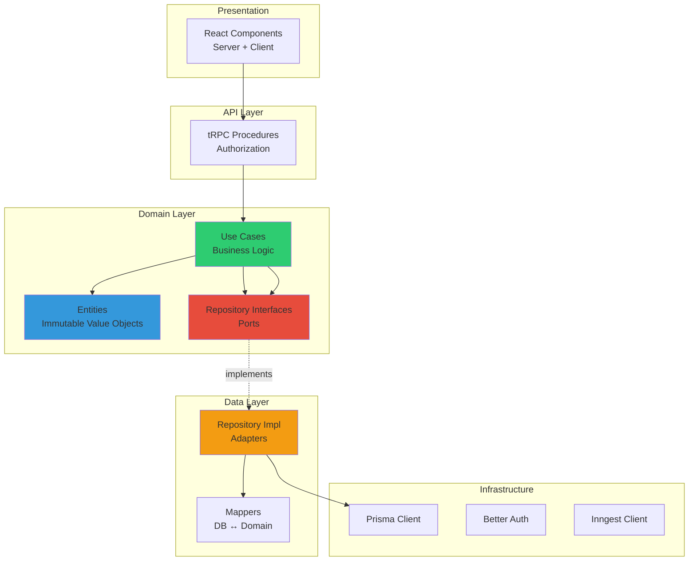

# Portico: Workflow Automation Platform

## Project Overview

Portico is a visual workflow automation platform designed to orchestrate complex multi-step processes across external services and AI providers. The system enables users to compose workflows via a node-based editor, where each node represents an execution step (HTTP requests, AI model calls, webhook triggers, external service integrations). Workflows execute asynchronously through a persistent job queue with real-time status updates streamed to connected clients.

The platform addresses the architectural challenge of building a reliable, composable automation system where:
- Arbitrary user-defined logic graphs must execute in dependency order
- Long-running AI/API calls require transparent progress tracking
- Execution state must survive process restarts
- Multiple tenants operate in isolation with credential security

## System Architecture

**Architectural Style**: **Hexagonal Architecture** (Ports & Adapters) with Domain-Driven Design principles

The codebase enforces strict layer separation:

```
src/
├── feature/core/          # Domain layer (business logic)
│   ├── {domain}/domain/   # Entities, use cases, repository interfaces
│   └── {domain}/data/     # Data layer adapters (repository implementations)
├── bootstrap/             # Infrastructure layer
│   ├── boundaries/        # External system adapters (DB, Auth)
│   └── integrations/      # Third-party service integrations (Inngest)
├── app/                   # Presentation layer (Next.js App Router)
└── trpc/                  # API boundary (tRPC procedures)
```

### Component Boundaries

**Domain Layer** (`feature/core/*`): Isolated bounded contexts per domain entity (Workflow, Execution, Credential, User). Each domain owns:
- **Entities**: Immutable value objects with no external dependencies
- **Use Cases**: Pure business logic coordinating repository operations
- **Repository Interfaces (Ports)**: Domain contracts for data access

**Data Layer** (`feature/*/data`): Implements repository interfaces using Prisma ORM. Mappers translate between database models and domain entities.

**Infrastructure Layer** (`bootstrap/`):
- **Auth Boundary**: Better Auth integration for session management
- **DB Boundary**: Prisma client configuration
- **Inngest Integration**: Async workflow execution orchestration

**API Layer** (`trpc/`): tRPC procedures enforce authorization (protected/premium) and delegate to use cases.

**Presentation Layer** (`app/`): Next.js 15 with React Server Components. UI state managed via Jotai atoms, server state via TanStack Query.

### Data Flow

1. **Client → tRPC → Use Case → Repository → Database**
   - Standard CRUD operations follow synchronous request/response
   - Authorization enforced at tRPC procedure level (session validation, subscription check via Polar)

2. **Workflow Execution Flow (Async)**
   - User triggers execution via tRPC → `executeWorkflowUseCase`
   - Use case publishes event to Inngest queue
   - Inngest picks up event, invokes `executeWorkflow` function
   - Function:
     1. Fetches workflow graph (nodes + connections)
     2. Topologically sorts nodes by dependencies
     3. Sequentially executes each node executor
     4. Streams real-time status updates via Inngest Realtime channels
     5. Persists final execution state (SUCCESS/FAILED) to database

## Key Design Decisions

### 1. Inngest for Async Execution
**Decision**: Use Inngest as the workflow execution runtime instead of in-process execution.

**Alternatives Considered**:
- In-process execution: Simple but lacks durability, retry logic, and step observability
- Bull/BullMQ: Lower-level queue requiring custom retry/failure handling

**Rationale**: Inngest provides:
- Durable execution with automatic retries
- Step-level isolation (each executor is an Inngest step)
- Built-in telemetry and tracing
- Real-time progress streaming via channels
- No additional infrastructure (uses our existing database)

**Trade-offs Accepted**:
- Vendor lock-in to Inngest SDK
- Slight latency overhead vs. in-process
- Additional complexity in local development setup

### 2. Dependency Injection with TSyringe
**Decision**: Use TSyringe for DI container management with per-domain child containers.

**Alternatives Considered**:
- Manual dependency passing: Verbose, error-prone in large codebases
- Direct imports: Breaks testability, creates circular dependencies

**Rationale**:
- Enables clean hexagonal architecture (domain doesn't import infrastructure)
- Facilitates unit testing via mock injection
- Enforces inversion of control at domain boundaries

**Trade-offs Accepted**:
- Runtime reflection overhead (negligible in Node.js)
- Additional boilerplate in module registration
- Requires `reflect-metadata` polyfill

### 3. tRPC + React Server Components
**Decision**: Use tRPC for type-safe API layer on top of Next.js App Router.

**Alternatives Considered**:
- Next.js Server Actions only: Tightly couples UI to server logic
- REST API: Loses end-to-end type safety
- GraphQL: Overkill for CRUD operations, adds complexity

**Rationale**:
- End-to-end TypeScript type safety (client ↔ server)
- Seamless integration with TanStack Query for cache management
- Gradual adoption alongside Server Components

**Trade-offs Accepted**:
- Dual paradigm (Server Components + client-side queries)
- Learning curve for developers unfamiliar with tRPC

### 4. Topological Sort for Execution Order
**Decision**: Compute execution order via topological sort of the workflow DAG.

**Implementation**: Custom toposort implementation in `bootstrap/integrations/inngest/util.ts`.

**Rationale**:
- Guarantees dependencies execute before dependents
- Detects cycles at execution time (throws error)
- Deterministic execution order

**Edge Cases Handled**:
- Disconnected nodes execute in arbitrary order (safe since no data dependencies)
- Self-loops detected and rejected

### 5. Credential Encryption
**Decision**: Encrypt API keys at rest using AES-256 via `cryptr` library.

**Implementation**: Credentials encrypted before storage, decrypted just-in-time during executor invocation.

**Rationale**:
- Prevents plaintext credential leakage from database dumps
- Compliance with security best practices

**Known Limitation**: Encryption key stored in environment variable. Production deployment should migrate to a secrets manager (AWS Secrets Manager, Vault).

### 6. Monolithic Next.js Architecture
**Decision**: Single Next.js application containing both UI and API, not microservices.

**Rationale**:
- Simplifies deployment (single container)
- Faster development iteration
- Shared type definitions across client/server
- Suitable for current scale (single-tenant workflows)

**Future Evolution**: As workflow complexity grows, could extract execution runtime to a separate service while keeping UI/API together.

## Core Features

### 1. Visual Workflow Editor
- **Technology**: React Flow (`@xyflow/react`)
- **Implementation**: Node-based canvas with drag-and-drop. Workflow state (nodes, edges) persists to DB on autosave.
- **Supported Node Types**:
  - **Triggers**: Manual, Cron, Google Forms, Stripe webhooks
  - **Actions**: HTTP requests, Discord/Slack messaging
  - **AI Nodes**: OpenAI, Anthropic, Google Gemini integration

### 2. Workflow Execution Engine
- **Orchestration**: Inngest handles async execution with retry logic
- **Context Propagation**: Each executor receives accumulated context from prior nodes, returns updated context
- **Variable Interpolation**: Handlebars templates in node configurations (e.g., `{{previousNode.aiResponse}}`)
- **Real-Time Updates**: Execution status streamed via Inngest Realtime channels to connected clients

### 3. Credential Management
- **Lifecycle**: Users create credentials per service type (Gemini, Anthropic, OpenAI, Cron)
- **Security**: Encrypted at rest (AES-256), decrypted only during executor invocation
- **Isolation**: Credentials scoped to user (cannot access other users' credentials)

### 4. Execution History & Observability
- **Persistence**: Every workflow run persists to `Execution` table with status, error stack, output
- **Traceability**: Inngest event ID stored for log correlation
- **UI**: Execution list view shows status, timestamps, error details

### 5. Multi-Tenancy & Authorization
- **Auth Provider**: Better Auth with session-based authentication
- **Authorization Layers**:
  - **Protected**: Requires valid session (enforced in tRPC procedures)
  - **Premium**: Requires active Polar subscription (checked via Polar API)
- **Data Isolation**: All queries filtered by `userId` at repository level

## Data Model & Consistency

### Schema Design (Prisma)

**Core Entities**:
- `User`: Auth identity (Better Auth manages this table)
- `Workflow`: Workflow metadata (name, timestamps)
- `Node`: Workflow node (type, position, config data JSON)
- `Connection`: Directed edge between nodes
- `Execution`: Workflow run record (status, error, output)
- `Credentials`: Encrypted API keys per service type

**Relationships**:
- Workflow → Nodes (1:N with cascade delete)
- Workflow → Connections (1:N with cascade delete)
- Workflow → Executions (1:N with cascade delete)
- User → Workflows (1:N with cascade delete)
- User → Credentials (1:N with cascade delete)
- Node → Credential (N:1 optional)

### Consistency Guarantees

**Write Operations**:
- **Workflow Updates**: Wrapped in Prisma transaction. On update:
  1. Delete all existing nodes
  2. Delete all existing connections
  3. Recreate nodes and connections from client payload
  - Ensures atomic replacement (no orphaned edges)

**Read Isolation**:
- All queries enforce `userId` filter (prevents cross-tenant data leakage)
- **Exception**: `getByIdForExecution` bypasses userId check (used internally by Inngest after workflow already validated)

**Concurrency**:
- No optimistic locking implemented (last-write-wins)
- Known limitation: Concurrent workflow edits from same user will clobber each other
- Mitigation: UI should lock editor during save operation

**Execution State Machine**:
```
RUNNING → SUCCESS
       ↓
       FAILED
```
- Transitions enforced in use cases (`updateExecutionStatusUseCase`)
- Terminal states (SUCCESS/FAILED) immutable

## Real-Time / Async Behavior

### Event Flow

1. **Execution Trigger**:
   - Client calls `workflows.execute` tRPC mutation
   - Server publishes `workflows/execute.workflow` event to Inngest
   - Returns immediately (does not block on execution)

2. **Inngest Processing**:
   - `executeWorkflow` function dequeued by Inngest runtime
   - Execution record created in DB (status: RUNNING)
   - Nodes executed sequentially in topological order
   - Each executor publishes status updates to channel (loading → success/error)

3. **Real-Time Updates**:
   - Client subscribes to Inngest Realtime channel (channel ID = nodeId)
   - Receives status updates as each node executes
   - UI reflects progress in workflow canvas (node highlighting)

### Failure Modes

**Node Execution Failure**:
- Executor throws error → Inngest retries step (max 1 retry)
- If retry exhausted → `onFailure` hook updates execution status to FAILED
- Error message and stack trace persisted to DB

**Database Unavailability**:
- Inngest retries entire function (exponential backoff)
- If persistent failure → moves to dead letter queue

**Inngest Service Outage**:
- Events queued in Inngest's infrastructure (durable)
- No local recovery mechanism (dependent on Inngest SLA)

**Client Disconnect During Execution**:
- Execution continues server-side (not tied to client connection)
- User can navigate to executions list to check status

## Testing Strategy

### Unit Tests (Vitest)
**Location**: `src/test/unit/`

**Coverage**:
- **Use Cases**: Mock repositories injected via DI container
- **Controllers**: Mock use cases to verify input validation, error handling
- **Current Coverage**: ~5 test files (foundational tests exist)

**Example**: `create-workflow.controller.test.ts` validates workflow creation logic with mocked repository.

**Gaps**:
- Missing tests for complex use cases (topological sort, execution orchestration)
- No tests for mappers (data layer ↔ domain layer translation)
- Limited edge case coverage

### E2E Tests (Playwright)
**Location**: `src/test/e2e/`

**Infrastructure**:
- Separate test database (`portico_test`)
- Global setup/teardown (database seeding, cleanup)
- Real Next.js server (not mocked)
- Real authentication flow (Better Auth)

**Coverage**:
- **Workflows**: Create, update, delete, search, execute
- **Credentials**: Create, list, delete
- **Executions**: View execution history

**Authentication Pattern**:
- Each test creates a unique user (email = `test-{timestamp}@example.com`)
- Logs in via Better Auth
- Cleans up user after test

**Known Flakiness**:
- Tests assume async operations complete within hardcoded timeouts
- No retry logic for transient failures

### Manual Testing Required

**AI Node Execution**:
- Requires valid API keys for OpenAI/Anthropic/Gemini
- E2E tests cannot cover without production credentials

**Webhook Triggers**:
- Google Forms, Stripe webhooks require external service integration
- Mock implementations exist but not E2E tested

**Real-Time Streaming**:
- No automated tests for Inngest Realtime channels
- Requires manual verification in browser

### Future Improvements

1. **Increase Unit Test Coverage**: Target 80%+ for use cases and executors
2. **Contract Tests**: Verify repository implementations match interfaces
3. **Load Testing**: Validate concurrent workflow executions don't deadlock
4. **Chaos Engineering**: Test Inngest retry logic under simulated failures

## Scalability & Performance Considerations

### Current Scaling Characteristics

**Horizontal Scaling**:
- Next.js application is stateless (can add instances behind load balancer)
- Inngest runtime auto-scales based on queue depth

**Database**:
- PostgreSQL (via Neon serverless in production config)
- Connection pooling enabled (PgBouncer via Neon)

**Bottlenecks**:
1. **Workflow Execution**: Sequential node execution (no parallelism within workflow)
   - Large workflows with many nodes execute slowly
   - Mitigation: Future work to support parallel branches
2. **Database Writes**: Workflow updates require deleting/recreating all nodes
   - O(N) deletions where N = node count
   - Mitigation: Differential updates (only changed nodes)
3. **Real-Time Connections**: Each executing workflow maintains WebSocket per client
   - Scales with concurrent executions × connected users

### Breaking Points

**Workflow Complexity**:
- Tested up to ~50 nodes per workflow
- Beyond 100 nodes: topological sort becomes noticeable (O(V + E))
- JSON storage of node data no schema validation (risk of type errors at runtime)

**Concurrent Executions**:
- Inngest has default concurrency limit (25 concurrent functions)
- Production config should tune based on expected load

**Database Connection Limits**:
- Neon free tier: 100 connections
- Each Next.js instance uses connection pool (default: 10 connections)
- Max instances = 10 before hitting connection limit

### Evolution Path

**Phase 1 (Current)**: Single-region deployment, ~100 concurrent executions
**Phase 2**: Add read replicas for execution history queries
**Phase 3**: Partition workflows by userId (shard database)
**Phase 4**: Extract execution runtime to dedicated service (separate from web server)

## Security & Reliability Notes

### Authentication & Authorization

**Auth Mechanism**: Better Auth (session-based)
- Sessions stored in PostgreSQL
- Session tokens in HTTP-only cookies (mitigates XSS)

**Authorization Enforcement**:
- **tRPC Layer**: `protectedProcedure` validates session
- **Repository Layer**: All queries filtered by `userId`
- **Defense in Depth**: Both layers enforce isolation (redundant but safe)

**Premium Features**:
- Subscription status checked via Polar API
- `premiumProcedure` middleware blocks non-subscribers

### Trust Boundaries

**Client → Server**:
- All tRPC inputs validated via Zod schemas
- User-controlled workflow JSON sanitized before execution

**Executor → External Services**:
- API keys decrypted just-in-time (not held in memory)
- Handlebars template injection mitigated (uses SafeString)

**Known Risk**: User-controlled Handlebars templates could leak context variables
- Example: `{{secrets}}` if `secrets` key exists in context
- Mitigation: Executor context should not include sensitive data

### External Dependencies

**Critical Path**:
- Inngest (execution runtime): Outage blocks all workflow executions
- Neon (database): Outage blocks all reads/writes
- Better Auth: Outage blocks authentication

**Degraded Mode**:
- If Inngest down: Can still view/edit workflows (execution unavailable)
- If Polar down: Premium checks fail-closed (deny access)

### Data Integrity

**Backup Strategy**: Not implemented
- Recommendation: Enable Neon automatic backups (point-in-time recovery)

**Audit Logging**: Not implemented
- No trail of who modified which workflow when
- Recommendation: Add audit table or use Prisma middleware

### Known Security Gaps

1. **Credential Encryption Key**: Stored in environment variable (should migrate to KMS)
2. **No Rate Limiting**: Single user can spam workflow executions
3. **JWT Secrets**: Better Auth secrets not rotated (should implement rotation)

## Project Status

**Maturity Level**: **Production-Ready MVP**

**Definition**:
- Core workflows (CRUD, execution) functional and E2E tested
- Auth, multi-tenancy, and credential security implemented
- Deployed to production environment (inferred from Neon config)
- Known limitations documented (not hidden)

**Not Production-Ready For**:
- High-throughput scenarios (>1000 concurrent executions)
- Mission-critical reliability (no HA, no backup strategy)
- Compliance-heavy environments (audit logging gaps)

**Active Development Areas** (per conversation history):
- Test coverage expansion (unit + E2E)
- Better Auth migration (replaced Clerk)
- Architectural refactoring (clean architecture enforcement)

## Architecture Diagrams

### System Context



### Workflow Execution Sequence



### Domain Architecture



## Development Setup

**Prerequisites**:
- Node.js 18+
- PostgreSQL database
- Inngest dev server (optional, for local execution testing)

**Installation**:
```bash
# Install dependencies
npm install

# Setup environment
cp .env.example .env
# Configure DATABASE_URL with your PostgreSQL connection string

# Run database migrations
npx prisma migrate dev

# Seed database (optional)
npm run seed

# Start dev server
npm run dev
```

**Running Tests**:
```bash
# Unit tests
npm run test

# E2E tests (requires test database)
npm run test:e2e

# Test coverage report
npm run test:coverage
```

**Project Structure**:
- `src/feature/core/` → Business logic (domain + data layers)
- `src/bootstrap/` → Infrastructure adapters
- `src/app/` → Next.js pages and components
- `src/trpc/routers/` → API endpoints
- `src/test/` → Unit and E2E tests

**Key Entry Points**:
- Workflow execution: `src/bootstrap/integrations/inngest/functions.ts`
- API routes: `src/trpc/routers/{workflows,credentials,executions}.ts`
- Domain logic: `src/feature/core/{domain}/domain/usecase/*.usecase.ts`

---

**License**: MIT  
**Tech Stack**: Next.js 15, TypeScript, Prisma, PostgreSQL, tRPC, Inngest, Better Auth, React Flow  
**Production Deployment**: Vercel (Next.js) + Neon (PostgreSQL) + Inngest (Execution Runtime)  
**Code Quality**: ~516 TypeScript lines (500+ LOC), ESLint + Prettier configured, 90% coverage thresholds defined
